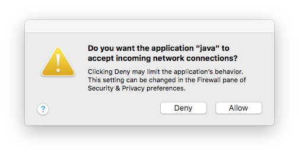
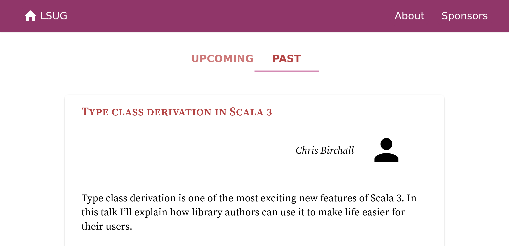

# Why contribute to open source

What are your favourite Scala libraries?

Perhaps you like [cats](https://github.com/typelevel/cats) for functional programming, or build actor systems with [Akka](https://github.com/akka/akka), or even dabble in machine learning with [Spark](https://github.com/apache/spark). If nothing else, you must be keen on [Scala](https://github.com/scala/scala) itself. All of these libraries, along with almost all of the Scala ecosystem, are *open source*. Their code is publicly available to view, download and improve. Anyone can contribute changes to their codebases. Including you.

Open source codebases empower you to code the improvements you want to see. You can shape the libraries you use, and in turn shape the wider Scala ecosystem. Your contributions are valuable. Many smaller Scala projects stay alive through the work of new contributors. By making a useful change, however small, you play a crucial part in the Scala community.

If you’re unfamiliar to open source coding, this codebase is a great place to start. There are a wealth of small improvements to make, and we encourage you to suggest your own. The [LSUG maintainers](#maintainers) will happily walk you through the process of making code changes.

You don’t have to contribute to the Scala community through code — we’re also looking for volunteers to help organize events. Reach out [here](https://forms.gle/J1pJQCD7AeVzYZhJ8) if you’d like to get involved.

# How to contribute to this project
 1. Introduce yourself in our [Gitter chat room](https://gitter.im/lsug/lsug-website).

	We’ll help you with any issues you have.
 2. Browse our [issues board](https://github.com/lsug/lsug-website/issues) for a code change you’d like to make.

	If you have an improvement in mind, please write up a new issue for it.
 3. If it’s your first time contributing to open source, take a look at the [first-contributions project](https://github.com/firstcontributions/first-contributions).

	This will walk you through the process of contributing to a GitHub repository.
 4. Fork and clone this repository.

	These terms are explained in the [first-contributions project](https://github.com/firstcontributions/first-contributions). If you’re still not quite sure what they mean, head over to [Gitter](https://gitter.im/lsug/lsug-website).
 5. [Setup the project](#Setup).
 6. [Explore the codebase](#The-Codebase).
 6. [Learn how to work on it](#Local-Development).
 7. Make your code change.

	Comment on the issue to let us know you’re working on it, then head over to [Gitter](https://gitter.im/lsug/lsug-website) to chat about the details.
 8. Make a pull request.

	The [first-contributions project](https://github.com/firstcontributions/first-contributions) walks you through this process. As always, feel free to ask for help on [Gitter](https://gitter.im/lsug/lsug-website).
 9. Get it deployed.

	The [LSUG maintainers](#maintainers) will take a look at your code and suggest changes. Once we’re happy, we’ll merge and deploy it ourselves.
	You can then add your name to our [contributors list](CONTRIBUTORS.md).

# Setup

## Tools

This project requires quite a few tools to get up and running. Don’t worry if you aren’t familiar with them yet. If you have any trouble, head over to [Gitter](https://gitter.im/lsug/lsug-website) and let us know.

By this point, you should have already used GitHub, git and a terminal. If not, get set up with the [first-contributions project](https://github.com/firstcontributions/first-contributions).

You’ll now need to install:
  
### Mill
[Version  0.8.0](http://www.lihaoyi.com/mill/)

####Windows
You have a few options here:
+ download Mill from: https://github.com/lihaoyi/mill/releases/download/0.9.3/0.9.3-assembly, and save it as **mill.bat**. You should copy file where it will be used or add it to Path
+ install Mill via [Scoop](https://scoop.sh/) and start use it immediately. You can install Scoop by following [these instructions](https://github.com/lukesampson/scoop/wiki/Quick-Start).

`scoop install mill`

Note that in some environments (such as WSL), mill might have to be run without a server (using -i, --interactive, --no-server, or --repl.)
 
### nodejs
[Version 10](https://nodejs.org/)

####Windows
You can download an installer for a preferable version on [releases page](https://nodejs.org/en/download/releases/) 

###yarn
[Version 1.22](https://yarnpkg.com/)
####Windows
There are few options for installing Yarn on Windows.
+ download the installer from an (official page)(https://classic.yarnpkg.com/en/docs/install/#windows-stable)
+ install via Scoop by running the following code in your console:

`scoop install yarn`

If Node.js is not installed, scoop will give you a suggestion to install it. Example:

`scoop install nodejs`

You will also need an IDE. If you’re undecided on one, we recommend [VSCode](https://code.visualstudio.com/) with the following extensions:
 - the Live Share Extension Pack
 - Scala (Metals)
 - Scala Syntax (official)
 - GitLens

This will enable you to pair program with a maintainer, should you want to.


## Checking your setup

The following `mill` commands need to be run in a terminal.

### Mill

Check you have mill installed.

```sh
mill version
```

This should print `0.8.0`.

### Scala

Check that the server tests pass.

```sh
mill server.test
```

Note: if you are Windows user you might use --no-service optione, like:

`mill server.test --no-service`

### NodeJS and Yarn

Check you can bundle the client code and styles.

```sh
mill web.bundle
```

### IDE

You should have syntax highlighting and code completion in your IDE. If not, you might need specific setup to hook it up to mill. Follow [mill’s guide on IDE support](http://www.lihaoyi.com/mill/index.html#ide-support).

## A first run

Start the website.

```sh
mill web.run
```

You should see the output:

```
[59/60] server.run
16:39:09.492 [ioapp-compute-2] INFO org.http4s.blaze.channel.nio1.NIO1SocketServerGroup - Service bound to address /0:0:0:0:0:0:0:0:8080
16:39:09.492 [ioapp-compute-5] INFO org.http4s.blaze.channel.nio1.NIO1SocketServerGroup - Service bound to address /0:0:0:0:0:0:0:0:8443
16:39:09.497 [blaze-selector-0] DEBUG org.http4s.blaze.channel.nio1.SelectorLoop - Channel initialized.
16:39:09.497 [blaze-selector-0] DEBUG org.http4s.blaze.channel.nio1.SelectorLoop - Channel initialized.
16:39:09.498 [ioapp-compute-5] INFO org.http4s.server.blaze.BlazeServerBuilder -
  _   _   _        _ _
 | |_| |_| |_ _ __| | | ___
 | ' \  _|  _| '_ \_  _(_-<
 |_||_\__|\__| .__/ |_|/__/
			 |_|
16:39:09.498 [ioapp-compute-7] INFO org.http4s.server.blaze.BlazeServerBuilder -
  _   _   _        _ _
 | |_| |_| |_ _ __| | | ___
 | ' \  _|  _| '_ \_  _(_-<
 |_||_\__|\__| .__/ |_|/__/
			 |_|
16:39:09.512 [ioapp-compute-5] INFO org.http4s.server.blaze.BlazeServerBuilder - http4s v0.21.7 on blaze v0.14.13 started at http://[::]:8080/
16:39:09.512 [ioapp-compute-7] INFO org.http4s.server.blaze.BlazeServerBuilder - http4s v0.21.7 on blaze v0.14.13 started at https://[::]:8443/
```


This starts the server on ports 8080 and 8443. The server will run in your terminal, so you won’t be able to use it for anything else.

If you use MacOS, you may see the following message:



The MacOS firewall needs your approval before letting Java run applications on a port. Click `Allow`.

Navigate to https://localhost:8443/ in any browser. You should see a security warning:


We use a fake, hence insecure, certificate for local development. You can safely bypass the warning. This is done in different ways depending on your browser.
 - In Firefox, click `Advanced…`, then `Accept the risk and continue`.
 - In Chrome, click `Advanced…`, then `Proceed to localhost (unsafe)`.
 - Let us know if you have a different browser. We’ll update this list with better instructions.

Finally, you should see the website home page:



You can stop the website by pressing `Ctrl-C` in your terminal.

# The Codebase

The main purpose of the LSUG website is to present information on LSUG events.

The website is made of two parts - the client and the server.

The **client** is written in [ScalaJS](https://github.com/scala-js/scala-js) - Scala that compiles to JavaScript - with the [ScalaJS React](https://github.com/japgolly/scalajs-react) web framework. It is responsible for the appearance and behaviour of the website.

The **server** is written in Scala using [http4s](https://github.com/http4s/http4s). It is responsible for serving the website content. It decodes event details from files and delivers them to the client.

You can read about client-server architectures in depth on the [MDN Web Docs](https://developer.mozilla.org/en-US/docs/Learn/Server-side/First_steps).

The entire website is written in [functional Scala](https://en.wikipedia.org/wiki/Functional_programming). The code is unit tested in some areas, but we encourage you to write better tests.

## Code structure

The project is laid out in four modules:

 - `client` contains the website ScalaJS code
 - `server` is responsible for serving the website and HTTP resources
 - `protocol` contains the code shared between the two
 - `web` is used for deployment and contains certain static assets

### Terminology

The following terms are used throughout the codebase.

 - A **meetup** is a gathering at which events are held.
 - An **event** is a single talk or workshop taking place in a meetup.
 - A **speaker** is a presenter or organizer of an event.
 - **markup** is formatted text in a webpage.
 - **meetup dot com** refers to [meetup.com](https://www.meetup.com/) related information.

### The client

The client’s behaviour is controlled by [ScalaJS React](https://github.com/japgolly/scalajs-react). It has the several key components.

| Component                 | Description        | Example                                    |
|---------------------------|--------------------|--------------------------------------------|
| `lsug.ui.Home`            | The home page      | https://www.lsug.co.uk                     |
| `lsug.ui.meetup.Meetup`   | An upcoming meetup | https://www.lsug.co.uk/meetups/2019-08-21  |
| `lsug.ui.event.EventPage` | A past event       | https://www.lsug.co.uk/events/2019-08-21/0 |

The appearance is styled with [SASS](https://sass-lang.com/), found in the [stylesheets directory](web/stylesheets).

### The server

The server is a webservice responsible for providing the client with event-related information. You can view its API at https://www.lsug.co.uk/api/.

Event information is stored in `.pm` files in the [resources directory](server/src/main/resources/meetups). These files are written in a custom format inspired by the [Pollen book publishing format](https://docs.racket-lang.org/pollen/). The server parses and decodes the event files into protocol data types, then serves these to the client. It also queries [meetup.com](https://www.meetup.com/) to find the number of attendees for each event.

# Local Development

The website is built using [mill](https://github.com/lihaoyi/mill), a build tool for Scala.

Start it with:

```sh
mill web.run
```

Then navigate to https://localhost:8443/ to see it in action.

## Command cheat sheet
 - `mill web.run` starts the website.
 - `mill server.compile` recompiles the server.
 - `mill -w web.bundle` hot-reloads the client.

## Working on the client

The client can be reloaded on the fly. You can keep the website running while you make code changes.

 1. Start the website.
 2. Bundle the JavaScript, styles and assets on the fly.
	```sh
	mill -w web.bundle
	```
	Any changes to the bundle will be compiled immediately.
 3. Make changes to the client code or styles.
 4. Reload https://localhost:8443/ in your browser.
	You should see your new changes.

## Working on the server

The server cannot be reloaded on the fly. You’ll need to restart the website for your changes to take place.

 1. Compile the server.
	```sh
	mill server.compile
	```
 4. Test it.
	```sh
	mill server.test
	```
 5. Start the website.
 6. You should see your changes at https://localhost:8443/.

## Working on the protocol

The protocol is used by the server, so also cannot be reloaded on the fly. You’ll need to restart the website to see your code changes.

 1. Compile the server and client. These both use the protocol.
	```sh
	mill server.compile
	mill client.compile
	```
 4. Test the server. This uses the protocol.
	```sh
	mill server.test
	```
 5. Start the website.
 6. You should see your changes at https://localhost:8443/

# Maintainers

The LSUG website is maintained by [Zainab Ali](https://github.com/zainab-ali/).
